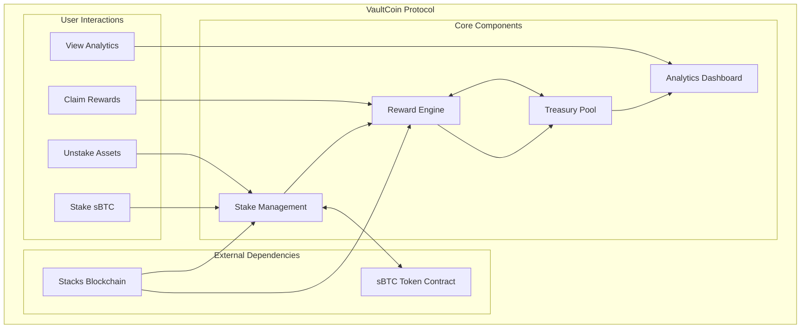
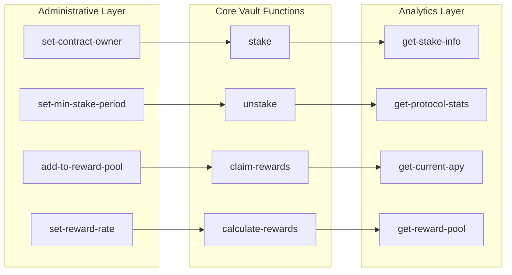

# VaultCoin Protocol 🏦

> **Next-Generation sBTC Yield Optimization Platform**

A revolutionary Bitcoin Layer 2 vault system that maximizes returns on sBTC assets through intelligent time-weighted reward mechanisms and dynamic APY optimization strategies for sophisticated DeFi participants.

[](https://docs.stacks.co/clarity)
[](https://docs.stacks.co)
[](LICENSE)

## 📖 Overview

VaultCoin Protocol represents the pinnacle of Bitcoin DeFi innovation, combining Stacks' battle-tested security with cutting-edge yield generation algorithms. Our protocol transforms idle sBTC holdings into productive assets through mathematically optimized reward distribution, flexible lock periods, and transparent governance.

### 🎯 Key Features

- **🔒 Secure Vault System**: Battle-tested smart contracts with comprehensive security mechanisms
- **📈 Dynamic APY Optimization**: Intelligent yield optimization based on market conditions
- **⏰ Time-Weighted Rewards**: Sophisticated reward calculation based on stake duration
- **🏛️ Transparent Governance**: Decentralized protocol administration with clear ownership controls
- **💰 Compound Rewards**: Automatic reward compounding for maximized returns
- **🚨 Emergency Controls**: Flexible withdrawal mechanisms with configurable lock periods
- **📊 Real-time Analytics**: Comprehensive performance dashboard and metrics

## 🏗️ Architecture

### System Overview



### Contract Architecture

#### 🗄️ Data Storage Layer

**Stake Management**

```clarity
;; Individual vault positions
(define-map stakes
  { staker: principal }
  { amount: uint, staked-at: uint }
)

;; Reward distribution history
(define-map rewards-claimed
  { staker: principal }
  { amount: uint }
)
```

**Protocol Configuration**

```clarity
;; Dynamic yield parameters
(define-data-var reward-rate uint u5)        ;; 0.5% APY in basis points
(define-data-var reward-pool uint u0)        ;; Treasury reserves
(define-data-var min-stake-period uint u1440) ;; ~10 days lock period
(define-data-var total-staked uint u0)       ;; Total Value Locked (TVL)
```

#### ⚙️ Core Functions Architecture



#### 🔢 Reward Calculation Algorithm

The protocol employs a sophisticated time-weighted reward mechanism:

```clarity
reward = (stake_amount × reward_rate × time_factor) / precision_factor

where:
- stake_amount: User's staked sBTC amount
- reward_rate: Annual yield rate in basis points
- time_factor: (stake_duration × 10000) / blocks_per_year
- blocks_per_year: 52,560 (Stacks blockchain annual blocks)
```

### 🛡️ Security Architecture

#### Error Handling System

```clarity
;; Comprehensive error constants
ERR_NOT_AUTHORIZED        (u100)  ;; Unauthorized access
ERR_ZERO_STAKE           (u101)  ;; Invalid stake amount
ERR_NO_STAKE_FOUND       (u102)  ;; No active stake
ERR_TOO_EARLY_TO_UNSTAKE (u103)  ;; Lock period not met
ERR_INVALID_REWARD_RATE  (u104)  ;; Invalid rate parameters
ERR_NOT_ENOUGH_REWARDS   (u105)  ;; Insufficient treasury
ERR_INVALID_PERIOD       (u106)  ;; Invalid time period
ERR_OWNER_UNCHANGED      (u107)  ;; Owner transfer validation
```

#### Access Control Matrix

| Function | Owner Only | Stake Required | Time Lock |
|----------|------------|----------------|-----------|
| `stake` | ❌ | ❌ | ❌ |
| `unstake` | ❌ | ✅ | ✅ |
| `claim-rewards` | ❌ | ✅ | ❌ |
| `set-reward-rate` | ✅ | ❌ | ❌ |
| `add-to-reward-pool` | ❌ | ❌ | ❌ |

## 🚀 Getting Started

### Prerequisites

- [Clarinet](https://github.com/hirosystems/clarinet) v2.0+
- [Node.js](https://nodejs.org/) v18+
- [Stacks Wallet](https://wallet.hiro.so/) for mainnet interaction

### Installation

1. **Clone the Repository**

   ```bash
   git clone https://github.com/ayo-victoria/vault-coin.git
   cd vault-coin
   ```

2. **Install Dependencies**

   ```bash
   npm install
   ```

3. **Run Contract Checks**

   ```bash
   clarinet check
   ```

4. **Execute Tests**

   ```bash
   npm test
   ```

### 🧪 Testing

The protocol includes comprehensive test coverage:

```bash
# Run all tests
npm test

# Run with coverage report
npm run test:report

# Watch mode for development
npm run test:watch
```

### 📦 Deployment

#### Testnet Deployment

```bash
clarinet deploy --network testnet
```

#### Mainnet Deployment

```bash
clarinet deploy --network mainnet
```

## 📚 API Reference

### 🔒 Core Functions

#### `stake(amount: uint)`

Deposits sBTC into yield-generating vault position.

**Parameters:**

- `amount`: sBTC amount to stake (must be > 0)

**Returns:** `(ok true)` on success

**Example:**

```clarity
(contract-call? .vault-coin stake u1000000) ;; Stake 1 sBTC
```

#### `unstake(amount: uint)`

Withdraws sBTC from vault with automatic reward harvesting.

**Parameters:**

- `amount`: sBTC amount to withdraw

**Returns:** `(ok true)` on success

**Constraints:**

- Must meet minimum lock period
- Amount cannot exceed staked balance

#### `claim-rewards()`

Harvests accumulated yield without closing position.

**Returns:** `(ok true)` on success

**Side Effects:**

- Resets yield calculation timestamp
- Updates lifetime rewards tracking

### 📊 Analytics Functions

#### `get-protocol-stats()`

Returns comprehensive protocol performance metrics.

**Response Structure:**

```clarity
{
  total-staked: uint,      ;; Total Value Locked
  reward-pool: uint,       ;; Available rewards
  reward-rate: uint,       ;; Current APY basis points
  min-stake-period: uint,  ;; Lock period in blocks
  current-apy: uint        ;; APY percentage display
}
```

#### `calculate-rewards(staker: principal)`

Calculates current pending rewards for a staker.

**Parameters:**

- `staker`: Principal address to query

**Returns:** Reward amount in sBTC units

### 🛠️ Administrative Functions

#### `set-reward-rate(new-rate: uint)`

Updates protocol yield rate (owner only).

**Parameters:**

- `new-rate`: New rate in basis points (max 1000 = 100% APY)

#### `add-to-reward-pool(amount: uint)`

Capitalizes reward treasury for sustainable yields.

**Parameters:**

- `amount`: sBTC amount to add to treasury

## 📈 Economic Model

### Yield Generation Mechanism

1. **Time-Weighted Rewards**: Longer stakes earn proportionally higher yields
2. **Dynamic APY**: Rates adjust based on treasury reserves and market conditions
3. **Sustainable Treasury**: Community-funded reward pool ensures long-term viability
4. **Compound Growth**: Automatic reward reinvestment maximizes returns

### Risk Parameters

| Parameter | Value | Purpose |
|-----------|-------|---------|
| Min Lock Period | 1,440 blocks (~10 days) | Prevent reward gaming |
| Max APY | 100% | Prevent excessive inflation |
| Treasury Buffer | Dynamic | Ensure reward sustainability |

## 🔐 Security Considerations

### Audit Status

- [ ] Internal Security Review
- [ ] External Security Audit
- [ ] Formal Verification
- [ ] Bug Bounty Program

### Known Limitations

1. **Oracle Dependency**: Manual reward rate adjustments
2. **Centralized Owner**: Single point of governance control
3. **Treasury Risk**: Reward sustainability depends on funding

### Best Practices

- Always verify contract addresses before interaction
- Start with small stakes to test functionality
- Monitor treasury levels before staking large amounts
- Keep track of lock periods for withdrawal planning

## 🤝 Contributing

We welcome contributions! Please see our [Contributing Guidelines](CONTRIBUTING.md) for details.

### Development Workflow

1. Fork the repository
2. Create a feature branch: `git checkout -b feature/amazing-feature`
3. Run tests: `npm test`
4. Commit changes: `git commit -m 'Add amazing feature'`
5. Push to branch: `git push origin feature/amazing-feature`
6. Open a Pull Request

## 📄 License

This project is licensed under the MIT License - see the [LICENSE](LICENSE) file for details.

## 🙏 Acknowledgments

- **Stacks Foundation** for the robust blockchain infrastructure
- **Hiro Systems** for excellent developer tooling
- **Bitcoin Community** for the foundational technology
- **DeFi Pioneers** for protocol design inspiration
